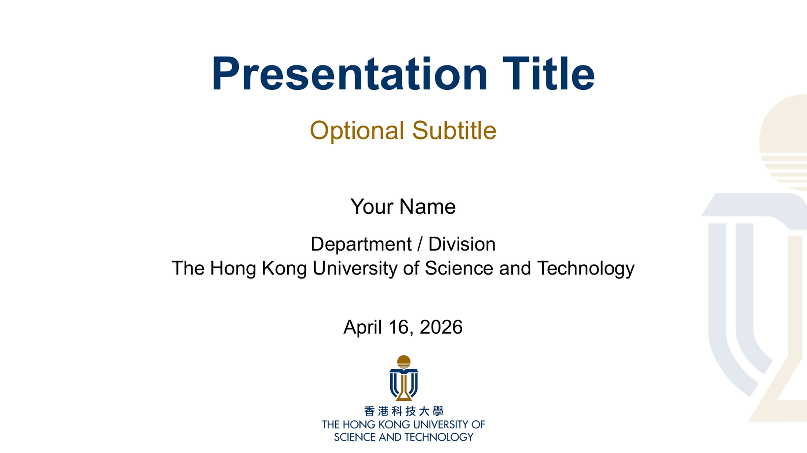
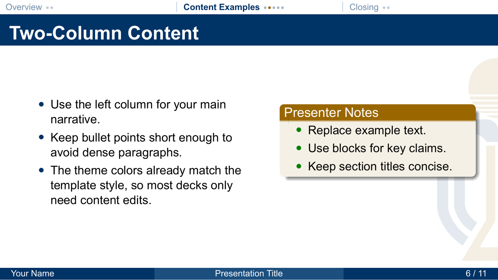
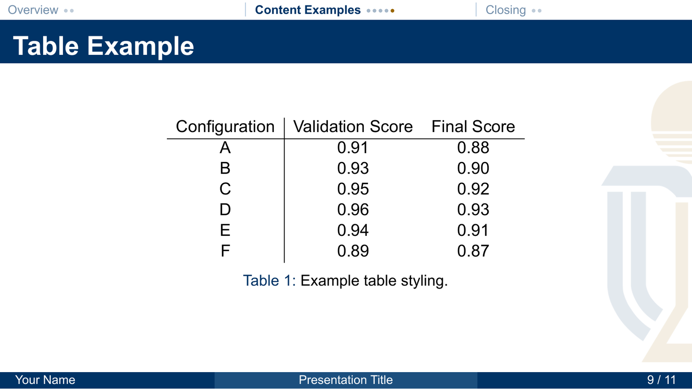

<div align="center">

# hkust-beamer-template

**Unofficial, community-maintained HKUST-styled Beamer template for academic presentations.**

<p>
  <a href="LICENSE"></a>
  
  
  
  
</p>

<p>
  A lightweight starting point for HKUST-flavored thesis talks, group meetings, course presentations, and research seminars.
</p>

<p>
  <a href="README.zh-CN.md">简体中文</a>
</p>

</div>

---

## Preview

**[Open sample PDF](docs/previews/hkust-beamer-template-preview.pdf)**

<sub>Click the screenshots below to view them in full resolution.</sub>

<p align="center">
  <a href="docs/previews/hkust-beamer-template-preview.pdf">
    
  </a>
</p>

<p align="center">
  <a href="docs/previews/content-slide.png">
    
  </a>
  <a href="docs/previews/table-slide.png">
    
  </a>
</p>

## Why this template?

This repository packages a ready-to-use Beamer theme with an HKUST-inspired visual style so you do not have to start from a blank slide deck every time.

It is meant to be:

- **fast to adopt** — clone, edit a few fields, compile;
- **clean by default** — balanced header/footer, restrained colors, roomy 16:9 layout;
- **easy to customize** — the sample deck is intentionally small and readable.

## Features

- HKUST-inspired blue / gold presentation theme
- 16:9 Beamer layout for modern projectors and screens
- Top navigation with section progress dots
- Compact single-row footer with author, title, and page count
- Built-in sample deck in `slide.tex`
- Arial fallback logic: if Arial is unavailable, it falls back to `TeX Gyre Heros`

## Quick start

### 1) Clone the repository

```bash
git clone https://github.com/Liu-KM/hkust-beamer-template.git
cd hkust-beamer-template
```

### 2) Compile the sample deck

```bash
xelatex -interaction=nonstopmode slide.tex
xelatex -interaction=nonstopmode slide.tex
```

### 3) Edit the metadata in `slide.tex`

Update:

- `\author{...}`
- `\institute{...}`
- `\title{...}`
- `\subtitle{...}`
- `\date{...}`

Then replace the example slides with your own content.

## Project structure

```text
.
├── HKUST_Beamer.sty      # theme definition
├── slide.tex             # example deck
├── pic/                  # required template assets
├── docs/previews/        # README screenshots + sample PDF
├── DISCLAIMER.md         # branding / usage notice for HKUST assets
├── LICENSE               # MIT license for code/docs authored here
├── README.md             # English README
└── README.zh-CN.md       # Simplified Chinese README
```

## Customization tips

- Duplicate the example content slides in `slide.tex` to keep consistent formatting.
- Replace the placeholder figure slide with your own plot, diagram, or system figure.
- Adjust subtitle/date/department lines only in one place; the footer and header stay consistent automatically.
- If you want to adapt the color system or navigation bar, start from `HKUST_Beamer.sty`.

## Branding notice

> This repository is **not** an official HKUST project.
> It is a community-made template inspired by HKUST presentation styling.

This repository includes HKUST-related visual assets only to make the template functional. Those marks and logos are **not** released under the MIT license for this repository.

Please read [DISCLAIMER.md](DISCLAIMER.md) before reusing or redistributing those assets.

Relevant official HKUST pages:

- Brand Assets Unit: <https://brand.hkust.edu.hk/>
- Official Marks or Logos: <https://brand.hkust.edu.hk/hkust-marks>
- University policy / guidelines entry: <https://dst.hkust.edu.hk/support-%26-resources//university-policies-%26-guidelines>

## License

The LaTeX code, theme code, and repository documentation authored here are released under the [MIT License](LICENSE).

HKUST names, marks, logos, and other official brand assets remain the property of HKUST and are excluded from that license unless HKUST explicitly states otherwise.
